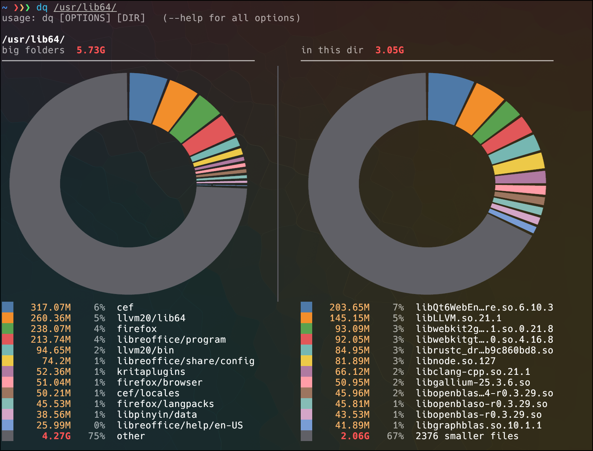
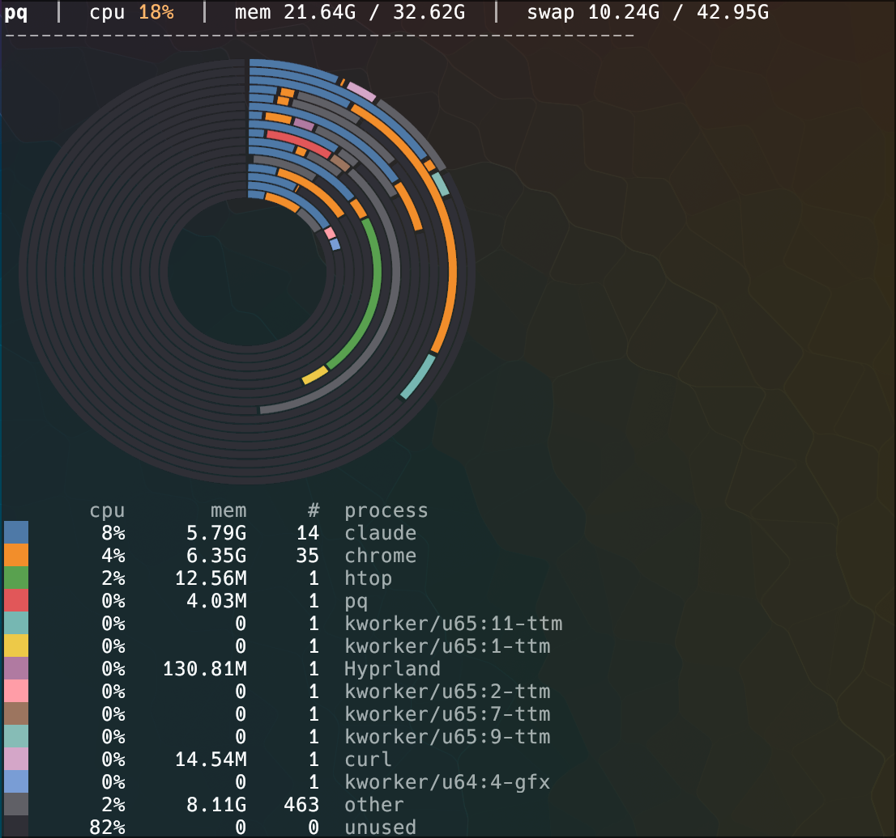

# qtools - query what's using your machine

`qtools` is a small, growing suite of fast, visual command-line tools for answering "what the hell is
eating my \<resource\>?" on Linux. Each tool is a terse two-letter `_q` ("query") utility, sharing a
common rendering core: donut charts on graphics-capable terminals, colored text bars everywhere else,
JSON for machines. Written in Rust.

* **`dq`** (disk query) - what's using my disk space? A faster, smarter `du`.
* **`pq`** (process query) - what's eating my CPU, memory, or swap? Who's listening on, or talking to,
  the network? A clustered, visual `top` with a friendlier `pkill` and an `lsof -i`/`ss` replacement
  built in.

## Getting started

```
$ ./build.sh && ./install.sh   # build + install dq and pq to ~/.local/bin (make sure it's on PATH)

$ pq                            # what's eating my CPU/memory/swap right now
$ dq                            # what's using disk space in the current directory
```

`sudo ./install.sh` installs system-wide (to `/usr/local/bin`) instead of just for your user.

## dq (disk query)



Recurses across a thread pool (10x+ faster than `du`), skips virtual filesystems (`/proc`, `/sys`) and
other-device mounts, sorts by size, formats human-readable by default. Only shows directories using at
least 1% of the tree (`-v`/`-V` to see more). When files sitting directly in a scanned directory add up
to a meaningful share, it breaks that "in this dir" total down into its biggest files. Renders donut
charts on graphics-capable terminals (kitty, Ghostty, iTerm2, WezTerm, Konsole, sixel) or bar charts
elsewhere; `QTOOLS_DEBUG=1` shows what was detected. Colors drop automatically when piped/redirected.

    dq [dir]              # scan dir (default: cwd)
    dq --threads N         # thread count
    dq -v / -V              # verbose / extra verbose (show more/all directories)
    dq --json                # machine-readable output
    dq --noprogress           # skip the progress indicator

Examples:

    dq /tmp
    dq -v --threads 50 /tmp
    dq --json / > sizes.json

## pq (process query)



Reads `/proc` (Linux only) and clusters processes by resolved identity, not just executable name: a JVM
running a Gradle daemon groups as `gradle`, not a pile of `java`; Chrome's renderer swarm collapses into
one `chrome (N procs)` (separate profiles/instances are told apart). `-v` expands a cluster to its
member processes.

    pq --cpu / --memory / --swap   # sort/chart metric (default: cpu)
    pq -n N                          # clusters to show (default 15)
    pq -v                             # expand clusters (processes; connections in --net mode)
    pq --interval MS                   # CPU sample interval (default 400ms)
    pq --json                           # machine-readable output
    pq PATTERN                           # filter report to matching clusters
    pq --net [--listen] [--port N]       # network mode: see below
    pq --kill PATTERN / --port N --kill   # kill mode: see below

Per-cluster memory/swap sums each member's RSS/`VmSwap`, which over-counts shared pages (same caveat as
most process viewers).

### pq --kill: a friendlier pkill

Matches the resolved identity, comm, and full command line (case-insensitive) - so `pq --kill gradle`
finds the JVM Gradle daemon that `pkill gradle` misses. Expands each match to its whole process subtree.
Previews the matching tree and confirms before acting. Escalates: SIGTERM, wait `--grace` seconds
(default 4), then SIGKILL survivors. Never signals pq itself, your shell/its ancestors, pid 1, or
unrelated sibling jobs.

    pq --kill PATTERN [--dry-run] [-y/--yes] [-x/--exact] [--signal SIG] [--grace SECONDS]

### pq --net: who is this box talking to?

Reads `/proc/net` directly (no lsof/ss) and attributes sockets to processes via `/proc/<pid>/fd`,
then clusters by the same resolved identity as the main report: Chrome's renderer swarm shows as
one `chrome` row. The overview is a grid, sorted by traffic: connection count, bytes sent and
received (from the same sock_diag counters `ss -i` reads; TCP only, cumulative per connection),
process, the ports it listens on, and the peer ports it talks to (`:443 x28`), with
world-exposed listeners (bound to `0.0.0.0`/`::`) in red. Unattributed rows show their ports too. On graphics terminals the donut
has two rings (outer = established, inner = listeners, same color per cluster, labeled
beneath), every row carries the color swatch of its slice, and a cutoff row counts anything
hidden by `-n`. Targeted queries answer in plain English instead of a donut: `pq --port N` and
`pq --net NAME` draw a card per owning process (user, command line, and each socket with a
reachability arrow: WORLD / local / iface), plus a paste-ready kill hint. A usage footer on the
overview lists the common queries. Listeners bound to all interfaces (`0.0.0.0`/`::`) are world-exposed: they're counted
in the header, their ports show red, and `-v` rows get a `[world]` marker. (Bind scope only; pq
does not interrogate the firewall.) `-v` rows also carry a direction tag: `lsn`, `in`
(accepted on a listened port), or `out` (this process dialed out). Without sudo, other users'
sockets still appear (grouped by user) but can't be tied to a process; run with sudo for full
attribution.

    pq --net                  # lsn/est by cluster, listening ports, sorted by total conns
    pq --net -v               # per-connection rows (direction, proto, state, local, peer)
    pq --net --listen         # only listening sockets: what is serving on this box?
    pq --port 8080            # who owns port 8080 (--port implies --net)
    pq --net --json           # machine-readable output
    pq --net PATTERN          # filter clusters, same matching as the main report

### pq --port N --kill: free up a port

Kills whatever is LISTENING on local port N (TCP listeners and bound UDP sockets only, so a
client whose ephemeral port happens to be N is never touched). Same preview/confirm flow and
TERM-grace-KILL escalation as `pq --kill`, with the matched socket shown in the preview. If the
listener can't be attributed to a process (someone else's, no sudo), pq refuses rather than
guessing.

    pq --port 8080 --kill [--dry-run] [-y] [--signal SIG] [--grace SECONDS]

In net mode without --port, pq --net --kill PATTERN (or with --listen) kills the trees of processes that own a matching socket and match the pattern.
